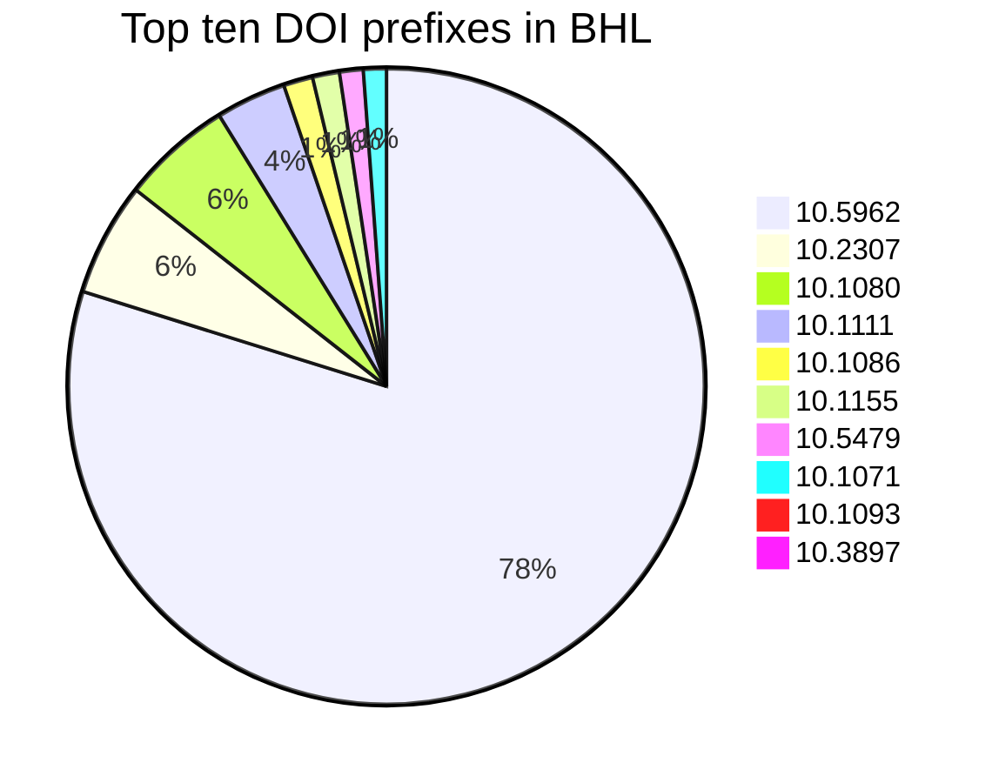
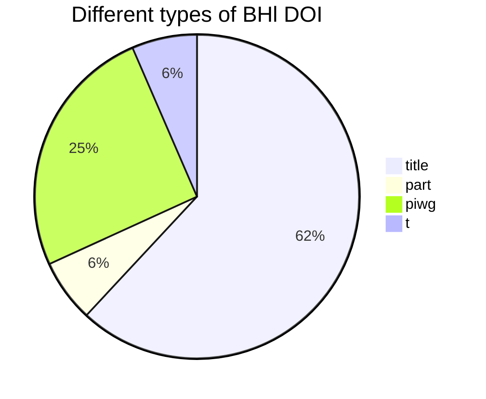
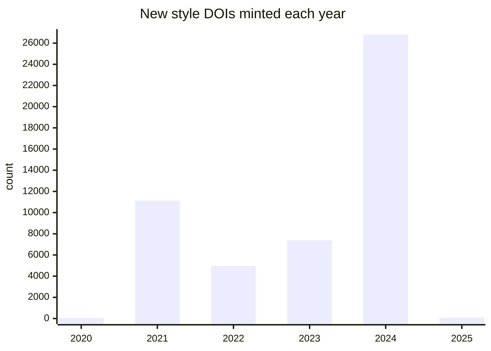
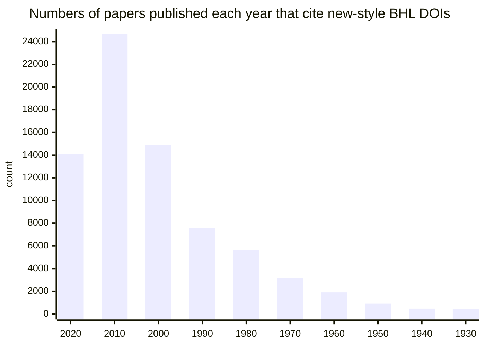
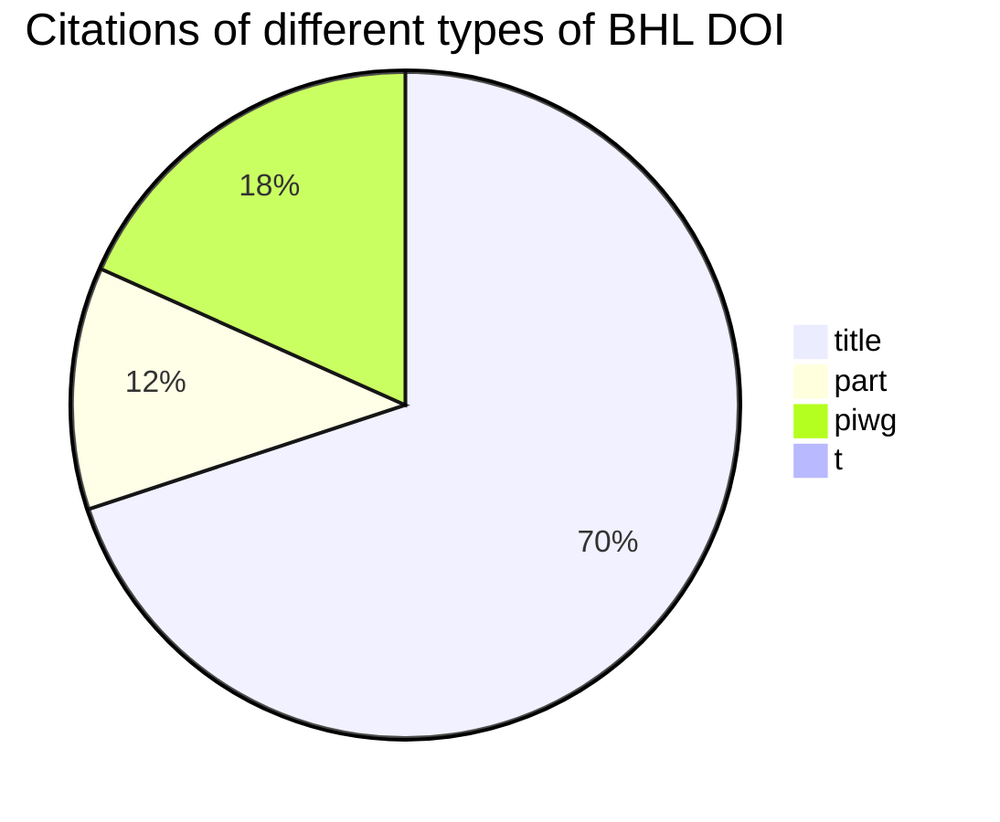

# Impact of new-style BHL DOIs "10.5962/p."
Script run 2025-04-03

## DOI prefixes in BHL
Typically different publishers have their own unique DOI prefix, but this can change as publishers merge, or acquire new content from other publishers. These are the prefixes for content hosted by BHL. Note that **10.5962** is the BHL prefix.

## Non BHL DOIs in BHL
DOIs minted by other organisations, may be commercial publishers, repositories, or BHL members.

|count|
--|
|70886|

## Types of BHL DOIs
Previously BHL has minted DOIs for "title" (e.g., monographs) and "parts" (e.g. articles). The PIWG is minting DOIs primarily for articles. The charts below summarise how many DOIs of the different sorts have been minted.

## New style BHL DOIs
Total number of DOIs minted as part of PIWG activities.

|prefix | count|
|--|--|
|10.5962/p. | 50395|

## New style BHL DOIs minted each year
Activity for each year.

|year | count|
|--|--|
|2020 | 46|
|2021 | 11129|
|2022 | 4962|
|2023 | 7390|
|2024 | 26794|
|2025 | 74|

## When does Unpaywall say BHL is best?
[Unpaywall](https://unpaywall.org/) has a database of open access versions of articles, which includes content in BHL. Here we count the number of non-BHL DOIs where BHL is the "best" source (an example is [10.1002/fedr.19110090704](http://doi.org/10.1002/fedr.19110090704), best viewed in Chrome or Firefox with the Unpaywall extension). This is a measure of how much BHL is enabling access to paywalled articles, and depends on BHL adding external DOIs to its content.

|count|
--|
|48278|

## Are people citing these new DOIs?
[OpenCitations](http://opencitations.net) is building a database of citations sourced from CrossRef and elsewhere. Citations are pairs of DOIs. We can count the number of citations for works in BHL with new style DOIs

|count|
--|
|74446|

## Top ten cited DOIs in OpenCitations
These are the most cited articles with new BHL DOIs.

|doi | count|
|--|--|
|[10.5962/p.325716](https://opencitations.net/index/search?text=10.5962%2Fp.325716&rule=citeddoi) | 577|
|[10.5962/p.360338](https://opencitations.net/index/search?text=10.5962%2Fp.360338&rule=citeddoi) | 376|
|[10.5962/p.313819](https://opencitations.net/index/search?text=10.5962%2Fp.313819&rule=citeddoi) | 259|
|[10.5962/p.234849](https://opencitations.net/index/search?text=10.5962%2Fp.234849&rule=citeddoi) | 236|
|[10.5962/p.324722](https://opencitations.net/index/search?text=10.5962%2Fp.324722&rule=citeddoi) | 235|
|[10.5962/p.185944](https://opencitations.net/index/search?text=10.5962%2Fp.185944&rule=citeddoi) | 224|
|[10.5962/p.234818](https://opencitations.net/index/search?text=10.5962%2Fp.234818&rule=citeddoi) | 223|
|[10.5962/p.185864](https://opencitations.net/index/search?text=10.5962%2Fp.185864&rule=citeddoi) | 205|
|[10.5962/p.185316](https://opencitations.net/index/search?text=10.5962%2Fp.185316&rule=citeddoi) | 185|
|[10.5962/p.258046](https://opencitations.net/index/search?text=10.5962%2Fp.258046&rule=citeddoi) | 183|

## If the new DOIs were a researcher what would be their _h_-index?
> The _h_-index is defined as the maximum value of _h_ such that the given author/journal has published at least _h_ papers that have each been cited at least _h_ times. [Wikipedia](https://en.wikipedia.org/wiki/H-index). See Winker K, Withrow JJ (2013) Small collections make a big impact. Nature 493(7433):480–480. [https://doi.org/10.1038/493480b](https://doi.org/10.1038/493480b)

_h_-index: **79**

## How relevant are articles with new-style BHL DOIs?
If articles with new style DOIs are relevant to current researchers then we would expect to see them cited in recently published papers. This table lists the number of citations of new DOI in each decade, showing that recently papers do indeed cite BHL content. Note that citation links are continually updated, so that these newly minted BHL DOIs are enabling citation links to be created between works have been published long before BHL began.

|decade | count|
|--|--|
|2020 | 14075|
|2010 | 24656|
|2000 | 14895|
|1990 | 7556|
|1980 | 5627|
|1970 | 3177|
|1960 | 1901|
|1950 | 911|
|1940 | 476|
|1930 | 421|
|1920 | 101|
|1910 | 44|
|1900 | 26|
|1890 | 3|

## Citations of all BHL DOIs
Total number of citations across all types of BHL DOI

|type | count|
|--|--|
|title | 284426|
|part | 47798|
|piwg | 74446|
|t | 0|

## Top ten cited BHL DOIs (of any kind)
These are the most cited articles with BHL DOIs for titles, parts, or segments
Note that the DOI [10.1017/cbo9780511703829](https://opencitations.net/index/search?text=10.1017%2Fcbo9780511703829&rule=citeddoi) is NOT a BHL DOI, but OpenCitations have clustered it with all the DOIs for the same work: The Descent of Man and Selection in Relation to Sex.

|doi | count|
|--|--|
|[10.5962/bhl.title.82303](https://opencitations.net/index/search?text=10.5962%2Fbhl.title.82303&rule=citeddoi) | 3769|
|[10.1017/cbo9780511703829](https://opencitations.net/index/search?text=10.1017%2Fcbo9780511703829&rule=citeddoi) | 2874|
|[10.5962/bhl.title.5851](https://opencitations.net/index/search?text=10.5962%2Fbhl.title.5851&rule=citeddoi) | 2850|
|[10.5962/bhl.title.542](https://opencitations.net/index/search?text=10.5962%2Fbhl.title.542&rule=citeddoi) | 2392|
|[10.5962/bhl.title.11332](https://opencitations.net/index/search?text=10.5962%2Fbhl.title.11332&rule=citeddoi) | 1725|
|[10.5962/bhl.title.6966](https://opencitations.net/index/search?text=10.5962%2Fbhl.title.6966&rule=citeddoi) | 1673|
|[10.5962/bhl.title.4489](https://opencitations.net/index/search?text=10.5962%2Fbhl.title.4489&rule=citeddoi) | 1476|
|[10.5962/bhl.title.8281](https://opencitations.net/index/search?text=10.5962%2Fbhl.title.8281&rule=citeddoi) | 1412|
|[10.5962/bhl.title.56234](https://opencitations.net/index/search?text=10.5962%2Fbhl.title.56234&rule=citeddoi) | 1409|
|[10.5962/bhl.title.4108](https://opencitations.net/index/search?text=10.5962%2Fbhl.title.4108&rule=citeddoi) | 1362|

